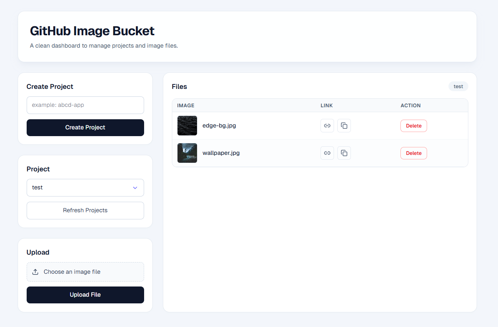

# Github Image Bucket API



This project is a proof of concept for using a GitHub repository as an image hosting service.
It now supports **multi-project buckets**, **API-key verification**, and an optional **Next.js frontend**.

## Table of Contents

- [What Changed](#what-changed)
- [Installation](#installation)
- [Environment Variables](#environment-variables)
- [API Endpoints](#api-endpoints)
  - [GET /health](#get-health)
  - [POST /projects](#post-projects)
  - [GET /projects](#get-projects)
  - [POST /projects/:projectName/upload](#post-projectsprojectnameupload)
  - [GET /projects/:projectName/files](#get-projectsprojectnamefiles)
  - [DELETE /projects/:projectName/files](#delete-projectsprojectnamefiles)
- [Frontend (Optional)](#frontend-optional)
- [Running the Server](#running-the-server)
- [Security and Abuse Prevention](#security-and-abuse-prevention)

---

## What Changed

Compared to the original single-folder API, this version adds:

- `x-api-key` verification for all backend routes.
- Multi-project storage under `uploads/<project-name>/`.
- Project creation/listing endpoints.
- Upload overwrite support (re-upload same filename updates existing file).
- Next.js frontend using a server-side proxy route (`/api/[...path]`) so browser clients do not need direct backend credentials.

---

## Installation

To set up and run this project, you need Node.js and npm installed.

1. Clone the repository:

```bash
git clone https://github.com/nandhu-44/GithubImageBucket.git
cd GithubImageBucket
```

1. Install backend dependencies:

```bash
npm install
```

1. Create backend `.env` from `.env.example` and set values.

2. Start backend server:

```bash
npm start
```

Backend runs on `http://localhost:5000` (or `PORT` from `.env`).

---

## Environment Variables

### Backend (`.env`)

- `PORT`: Server port (default `3000`, your example uses `5000`).
- `API_KEY`: Shared key required in `x-api-key`.
- `GITHUB_TOKEN`: GitHub token with repo content write access.
- `GITHUB_REPO`: Repository in format `owner/repository`.
- `GITHUB_BRANCH`: Target branch (e.g., `main`).

Example (`.env.example`):

```env
PORT=5000
API_KEY=replace_with_secure_api_key
GITHUB_TOKEN=ghp_xxx
GITHUB_REPO=owner/repository
GITHUB_BRANCH=main
```

### Frontend (`frontend/.env.local`)

- `BACKEND_BASE_URL`: Backend API URL (e.g., `http://localhost:5000`).
- `BACKEND_API_KEY`: Same value as backend `API_KEY`.

Example (`frontend/.env.example`):

```env
BACKEND_BASE_URL=http://localhost:5000
BACKEND_API_KEY=replace_with_secure_api_key
```

---

## API Endpoints

> All backend endpoints require header:
>
> `x-api-key: <API_KEY>`

### GET /health

Health check endpoint.

**Response (200):**

```json
{ "status": "ok" }
```

---

### POST /projects

Creates a project folder in GitHub as:
`uploads/<projectName>/_placeholder.txt`

#### Request

- **Content-Type**: `application/json`
- **Body**:

```json
{ "projectName": "abcd-app" }
```

#### Response

- **201 Created** (new project):

```json
{
  "projectName": "abcd-app",
  "created": true,
  "placeholder": "https://raw.githubusercontent.com/<repo>/<branch>/uploads/abcd-app/_placeholder.txt"
}
```

- **200 OK** (already exists): same response with `created: false`.

---

### GET /projects

Lists available project folders under `uploads/`.

#### Response (200)

```json
{
  "projects": ["abcd-app", "blah-test-server"]
}
```

---

### POST /projects/:projectName/upload

Uploads a file into the selected project folder.

#### Request

- **Content-Type**: `multipart/form-data`
- **Body**: form-data key `file`

#### Response (200)

```json
{
  "publicUrl": "https://raw.githubusercontent.com/<repo>/<branch>/uploads/<projectName>/<file_name>",
  "projectName": "abcd-app",
  "fileName": "logo.png"
}
```

---

### GET /projects/:projectName/files

Lists files for a given project (excluding `_placeholder.txt`).

#### Response (200)

```json
[
  {
    "name": "logo.png",
    "url": "https://raw.githubusercontent.com/<repo>/<branch>/uploads/abcd-app/logo.png"
  }
]
```

---

### DELETE /projects/:projectName/files

Deletes a file from a project.

#### Request

- **Content-Type**: `application/json`
- **Body**:

```json
{ "fileName": "logo.png" }
```

#### Response (200)

```json
{ "message": "File \"logo.png\" deleted successfully" }
```

---

## Frontend (Optional)

A Next.js frontend lives in `frontend/`.

It calls Next API route `frontend/src/app/api/[...path]/route.js`, which proxies requests to backend and injects `x-api-key` server-side.

This avoids exposing backend API key in browser code.

Run frontend:

```bash
cd frontend
npm install
npm run dev
```

---

## Running the Server

Backend:

```bash
npm install
npm start
```

Frontend (optional):

```bash
cd frontend
npm install
npm run dev
```

---

## Security and Abuse Prevention

To reduce risk of repository restrictions or account abuse flags:

- Keep repos private unless public access is required.
- Never commit real tokens or API keys.
- Rotate keys immediately if leaked.
- Add rate limiting and request logging in production.
- Upload only content you are authorized to store and distribute.
- Do not use this system for malware, phishing, or prohibited content.

You are responsible for complying with GitHub Terms and applicable laws.
